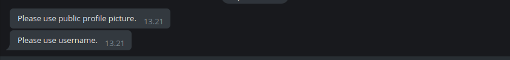

# simple-telegram-admin-bot

1. Delete default message when member left or join, then greeting them.

2. If member does not have username or profile picture, their new message in group will be deleted, then bot will chat private to them.
